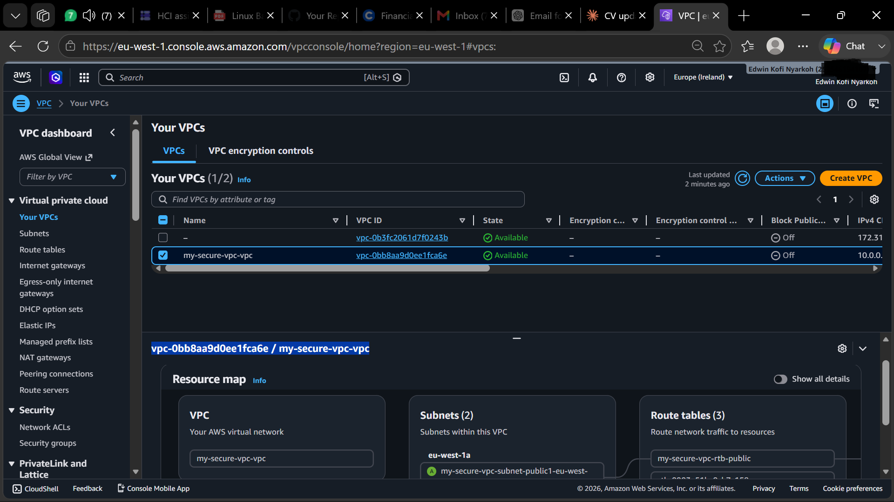
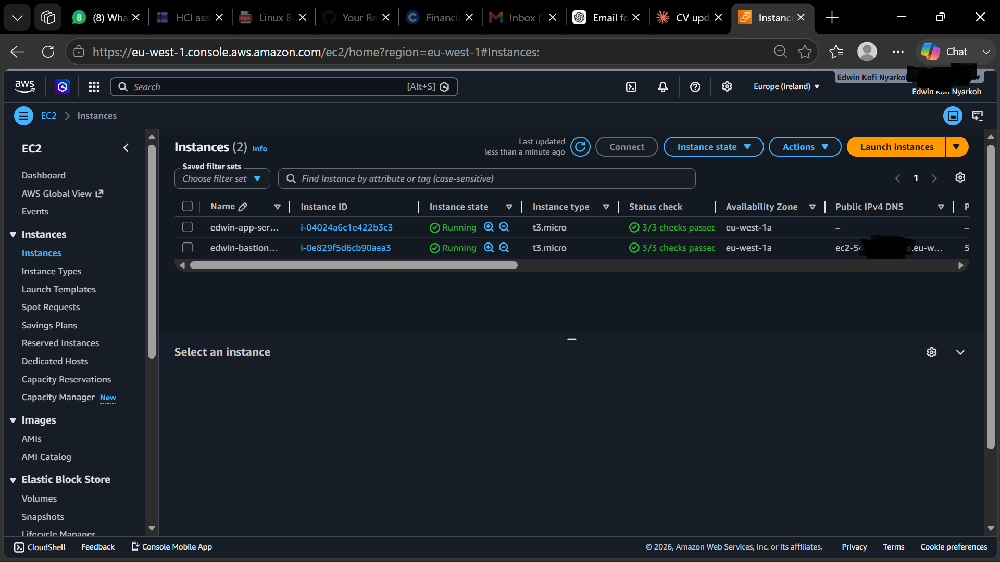
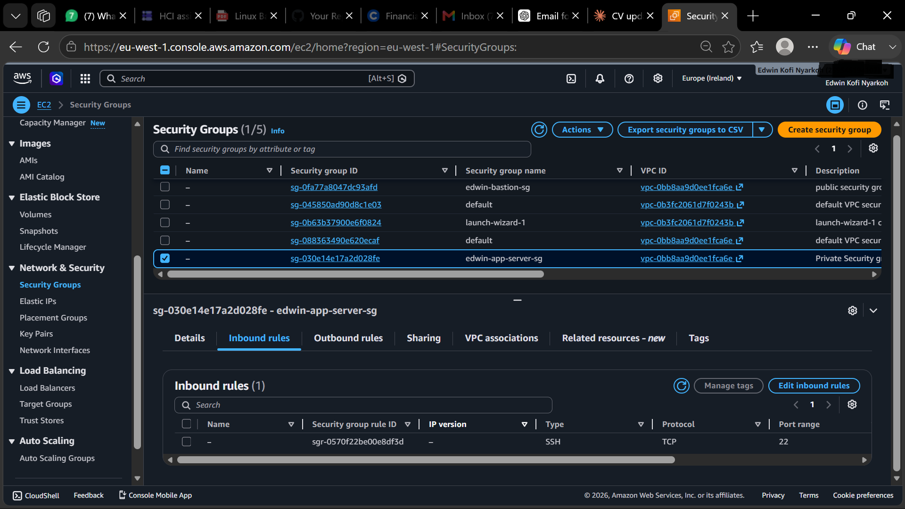
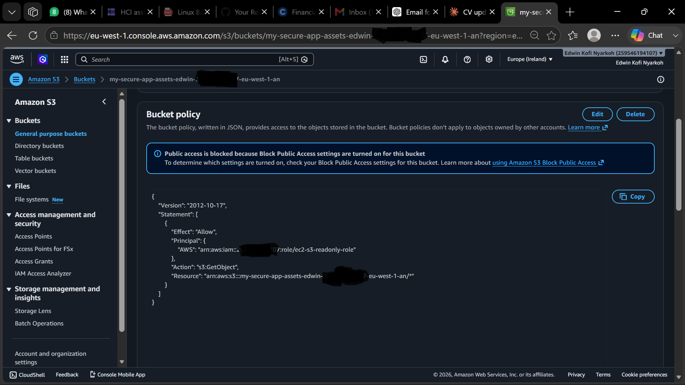
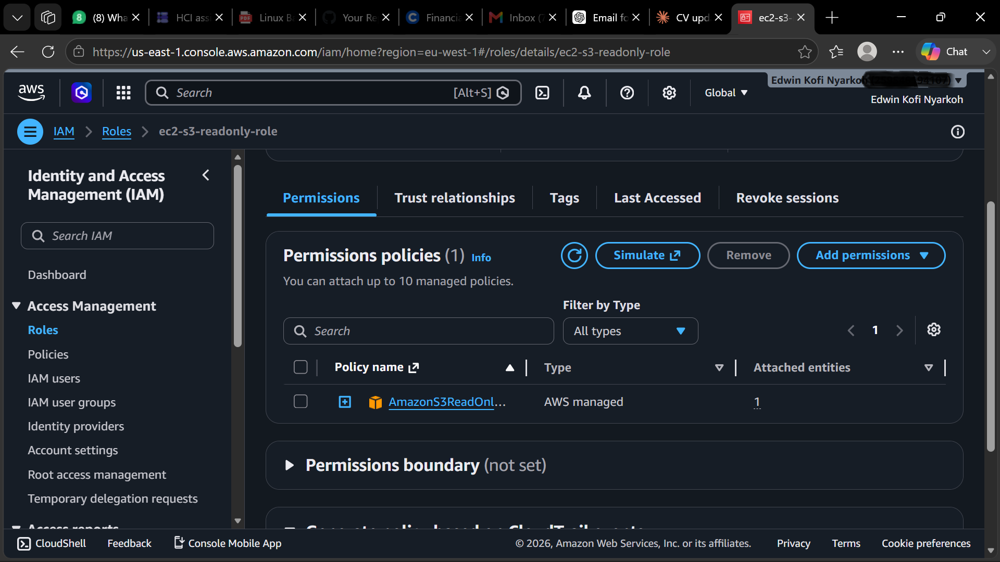

# Secure Multi-Tier AWS Cloud Infrastructure

## What Is This Project?

This project sets up a secure cloud environment on AWS — 
the kind of infrastructure real companies use to host their 
applications safely. Instead of just deploying a website, 
the focus here is on *how* servers are protected, *who* 
can access what, and *how* everything is monitored.

Think of it like building the security system of a building 
— the locked doors, the CCTV cameras, and the alarm — 
rather than the building itself.

---

## Architecture Overview

---

## What Was Built

### 1. Custom VPC (Virtual Private Cloud)
A VPC is like your own private section of the AWS cloud. 
Inside it, two separate areas (subnets) were created:
- **Public subnet** — visible to the internet (where the 
  bastion host lives)
- **Private subnet** — completely hidden from the internet 
  (where the app server lives)

### 2. Bastion Host
A bastion host is a single, heavily restricted server in 
the public subnet that acts as the only entry point into 
the private network. Think of it as the security guard 
at the front gate. SSH access is allowed only from one 
specific IP address.

### 3. Security Groups
Security groups act like firewalls for each server, 
controlling exactly what traffic is allowed in and out.

- **edwin-bastion-sg** — allows SSH only from one IP
- **edwin-app-sg** — allows SSH only from the bastion, 
  nothing else

### 4. S3 Bucket (Secure Storage)
An S3 bucket was created to store application assets with:
- All public access blocked
- Server-side encryption enabled (SSE-S3)
- A bucket policy allowing access only to the EC2 IAM role — 
  no other user or service can touch it

### 5. IAM Role (Identity and Access Management)
Instead of giving the EC2 server a username and password 
to access S3, an IAM role was attached directly to the 
instance. The role has read-only access to S3 — it cannot 
delete or modify anything. This is called Least Privilege.

### 6. CloudTrail (Audit Logging)
CloudTrail records every single action taken in the AWS 
account — who did what, when, and from where. Logs are 
stored in a separate locked S3 bucket so they cannot be 
tampered with.

---

## Security Decisions Explained

| Decision | Why It Matters |
|---|---|
| Private subnet for app server | Cannot be reached directly from the internet |
| Bastion host | One controlled entry point, everything else is blocked |
| IAM role instead of access keys | No hardcoded credentials that can be stolen |
| S3 bucket policy | Only the EC2 instance can read files, nothing else |
| Block all public access on S3 | Prevents accidental data exposure |
| CloudTrail logging | Full record of every API call for security auditing |

---

## How the SSH Access Works

Your Laptop → SSH into Bastion Host (public subnet)
↓
SSH into App Server (private subnet)

The app server has no public IP. The only way to reach 
it is through the bastion. This limits the attack surface 
significantly.

---

## Tools and Services Used

AWS VPC · EC2 · S3 · IAM · CloudTrail · Security Groups · 
Network ACLs · Amazon Linux 2023 · Git Bash